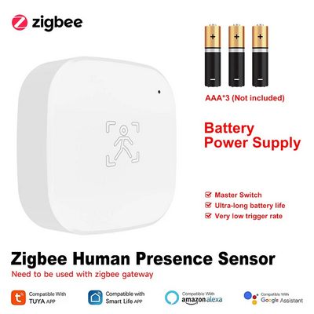
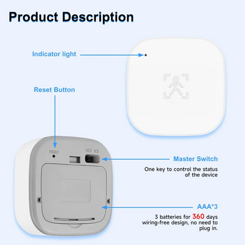

                    
# Zigbee конвертер для датчика присутствия iHseno Human Presence Sensor

Конвертер для интеграции датчика присутствия iHseno Human Presence Sensor (модель `_TZE284_debczeci`) с Zigbee2MQTT.

## Поддерживаемые устройства
- iHseno Human Presence Sensor (AliExpress: [ссылка](https://aliexpress.ru/item/1005009110929003.html))

## Особенности
- Обнаружение присутствия человека
- Отображение уровня заряда батареи
- Настройка чувствительности PIR (низкая/средняя/высокая)
- Настройка времени задержки PIR (15с/30с/60с)

## Установка
1. Скопируйте файл `tuya_tze284_pir.js` в папку `\external_converters\` вашей установки Zigbee2MQTT
2. Перезапустите Zigbee2MQTT

## Поддерживаемые функции
| Функция | Описание |
|---------|----------|
| `presence` | Обнаружение присутствия (true/false) |
| `battery` | Уровень заряда батареи в % |
| `pir_sensitivity` | Чувствительность датчика (low/middle/high) |
| `pir_time` | Время задержки (15s/30s/60s) |
